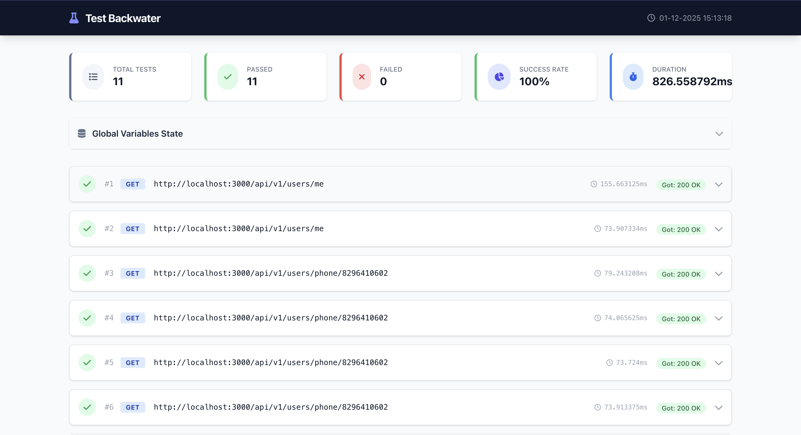
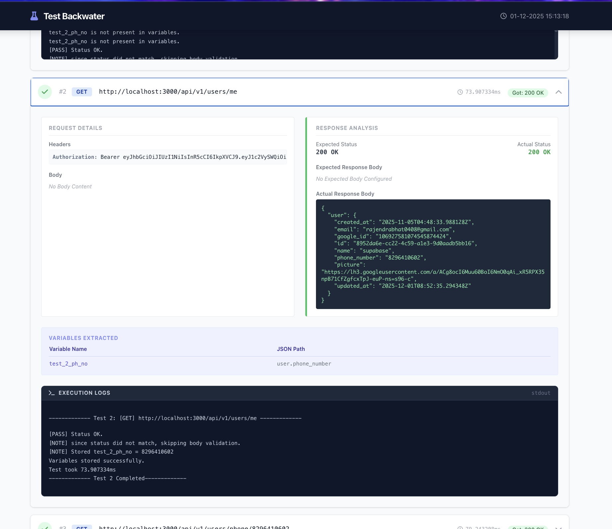

# 🌊 Backwater


**Backwater** is a lightweight, zero-dependency HTTP integration testing tool written in Go.

It allows you to define API test scenarios in a simple JSON file, run them sequentially, and generate beautiful HTML reports. Think of it like a command-line version of Postman Runner, but faster and easier to automate in CI/CD pipelines.

## 🚀 Features

  * **JSON-Based Configuration:** Define your entire test suite in a single readable file.
  * **Variable Substitution:** Use dynamic variables (like `$base_url$`) in URLs, headers, and bodies.
  * **Response Chaining:** Extract data from one response (e.g., an Auth Token or User ID) and use it in the next request.
  * **Smart Validation:**
      * **Subset Matching:** You only need to define the fields you care about in `expected_response`.
      * **Regex Support:** Validate formats (like UUIDs or Dates) using regex patterns.
      * **Unordered Arrays:** Validates list items regardless of their order.
  * **HTML Reporting:** Automatically generates a styled report with pass/fail stats.

-----

## 🛠️ Getting Started

### Prerequisites

You need [Go installed](https://go.dev/dl/) on your machine.

### Installation

Clone the repository and build the tool:

```bash
git clone https://github.com/Yuddhaa/backWater.git
cd backWater
go build -o backwater
```

### Running a Test

You can run the tool using the compiled binary or directly with Go:

```bash
# Using Go directly
go run . -path=./my-test.json

# Using the binary
./backwater -path=./tests/auth-flow.json -output_dir=./my-reports
```

### Command Line Flags

| Flag | Description | Default |
| :--- | :--- | :--- |
| `-path` | Path to your test configuration JSON file. | `./test.json` |
| `-output_dir` | Directory where HTML reports will be saved. | `./reports` |
| `-template` | Path to the HTML template file.  | `./template.html` |

-----

## 📝 The `test.json` Structure

The configuration file has three main parts: `name`, `variables`, and `tests`.

### 1\. Variables (`variables`)

Global variables that can be used anywhere in your tests using `$variable_name$`. Useful for base URLs or static tokens.

### 2\. The Test Array (`tests`)

| Field | Description |
| :--- | :--- |
| `method` | HTTP method (GET, POST, PUT, DELETE, etc.). |
| `url` | Target URL. Supports variable substitution (e.g., `http://api.com/users/$user_id$`). |
| `header` | Map of HTTP headers. Supports substitution. |
| `body` | The request payload (JSON). Supports substitution in string values. |
| `expected_status` | exact string match for the HTTP status (e.g., `200 OK`, `401 Unauthorized`). |
| `expected_response` | Backwater uses Subset Validation. So you can mention a subset of the actual response you want to validate. |
| `var_to_store` | Map where Key is the *variable name* and Value is the *JSON path* in the response to extract. <br>[NOTE]: `test_{num}` is prefixed to the variable name. So you have to use this prefixed variable name in the further tests when required.|


#### Request Configuration

  * **method**: `GET`, `POST`, `PUT`, `DELETE`, etc.
  * **url**: The endpoint URL.
  * **header**: Key-value map of HTTP headers.
  * **body**: The JSON payload (for POST/PUT).

#### Validation (`expected_response`)

Backwater uses **Subset Validation**. This means:

  * If the API returns 50 fields, but you only include 2 in `expected_response`, the test **PASSES** as long as those 2 match.
  * **Regex:** Use `"regex:pattern"` to validate dynamic strings.

#### Chaining (`var_to_store`)

Extract values from the response to use in future tests.

  * **Format:** `"variable_name": "json.path.to.value"`
  * **Accessing it later:** The tool automatically saves it as `$test_{testNumber}_{variableName}$`.

-----

## 💡 Complete Example

Here is a complete `test.json` showing a full flow:

1.  **Test 1:** Fetches a user profile, validates the ID using Regex, and extracts the phone number.
2.  **Test 2:** Uses that extracted phone number in a new request.

<!-- end list -->

```json
{
    "name": "User Profile Flow",
    "variables": {
        "base_url": "http://localhost:3000",
        "creator_access_token": "eyJhbGciOiJIUzI1NiIsInR5cCI..."
    },
    "tests": [
        {
            "num": 1,
            "method": "GET",
            "url": "$base_url$/users",
            "header": {
                "Authorization": "Bearer $creator_access_token$"
            },
            "expected_status": "200 OK",
            "expected_response": {
                "user": {
                    "id": "regex:^[0-9a-fA-F-]{36}$", 
                    "email": "john_doe@gmail.com",
                    "role": "admin"
                }
            },
            "var_to_store": {
                "extracted_email": "user.email"
            }
        },
        {
            "num": 2,
            "method": "POST",
            "url": "$base_url$/verify-email",
            "header": {
                "Content-Type": "application/json"
            },
            "body": {
                "email": "$test_1_extracted_email$"
            },
            "expected_status": "200 OK",
            "expected_response": {
                "success": true,
                "message": "regex:^Verification sent.*"
            }
        }
    ]
}
```

### 🔍 Breakdown of the Example:

1.  **Regex Validation:**
      * `"id": "regex:^[0-9a-fA-F-]{36}$"` checks if the ID is a valid UUID without caring what the specific characters are.
2.  **Variable Extraction:**
      * In Test 1, we find `user.email` in the response and save it as `extracted_email`.
3.  **Variable Chaining:**
      * In Test 2, we use `$test_1_extracted_email$`.
      * *Naming Convention:* `test_` + `{Test Number}` + `_` + `{Variable Name}`.

-----

## 📊 Reports

After running the tests, check the `./reports` folder. You will find an HTML file (e.g., `User_Profile_Flow_15-11_10.30.html`). Open it in your browser to see:

  * Success/Fail status for every test.
  * Request/Response logs.
  * Diffs showing why a test failed.
  * Total execution time.




-----

## 🤝 Contributing

1.  Fork the repo.
2.  Create your feature branch (`git checkout -b feature/amazing-feature`).
3.  Commit your changes (`git commit -m 'Add some amazing feature'`).
4.  Push to the branch.
5.  Open a Pull Request.

